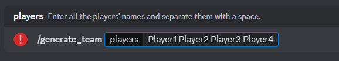
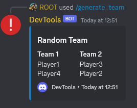
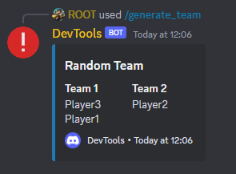
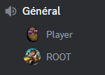
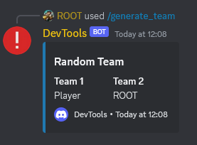

# TEAM BUILDER DISCORD.JS

## DESCRIPTION

This is a team builder command for Discord.js bots.

## PREREQUISITES

- [Node.js](https://nodejs.org/en/)
- A bot like [bot-discord.js-base](https://github.com/Eliott-B/bot-discord.js-base)

## INSTALLATION

1. Clone the repository
```bash
git clone https://github.com/Eliott-B/Team-Builder-discord.js.git
```

2. Move the file 'generateTeam.js' to your commands folder.

## SCREENSHOTS








## CONTRIBUTORS

- [Eliott-B](https://github.com/Eliott-B)

*The function 'shuffle' is from [Mike Bostock](https://bost.ocks.org/mike/shuffle/)*

## LICENSE

[MIT](https://choosealicense.com/licenses/mit/)

## HELP

If you need help, you can contact me on Discord: Eliott#5072

## DONATE

If you want to support me, you can donate on [BuyMeACoffee](https://www.buymeacoffee.com/eliottb)

<a href="https://www.buymeacoffee.com/eliottb"></a>